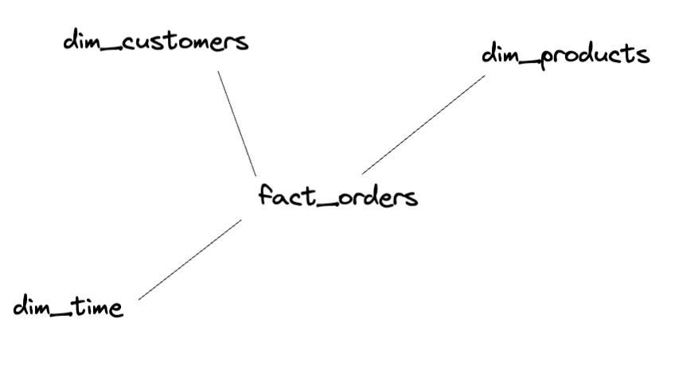

# Data Modeling

## Star Schema

Facts

- a measure of something that occurred, like an event
- it tells you what occurred and usually when it occurred
- usually comes with some sort of value (measure) associated with what occurred
- tend to be quite large tables vertically (always appending)
- contain many foreign keys to dimensions

Dimensions

- descriptive attributes of a fact
- usually contain a group of attributes in one table
- tend to be small, but can be wide
- tend not to change much (slowly changing dimensions)

Example:

- structure is very dependent on the needs of the business
- important to understand what is required to be analyzed
- often times this is something a business analyst could help a lot with
